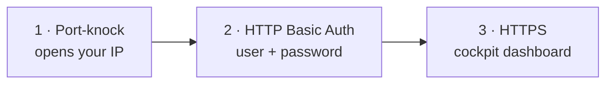

# Accessing the cockpit

By default, the cockpit is protected by **three layers**. To open it you first **knock**,
then authenticate.



Port-knocking is optional during installation, but **strongly recommended**. If you
disabled it, skip the knock step and open `https://COCKPIT_DOMAIN/` directly. HTTPS and
HTTP Basic Auth still protect the cockpit, but its authentication endpoint is visible to
internet scanners and brute-force attempts.

## What is port-knocking, and why?

The cockpit controls your whole lab, so it should not be openly reachable. With
port-knocking, `https://COCKPIT_DOMAIN/` returns **403 Forbidden** to everyone by
default. Only after your machine sends a secret **sequence of connection attempts** to
specific ports — the "knock" — does the server add *your* IP to an allow-list and let
you through.

This hides the admin surface from scanners and bots: without the correct sequence, the
cockpit simply isn't accessible — and there's no login form to brute-force.

!!! info "Your sequence is unique"
    The knock sequence is **randomly generated for your install** and printed in your
    [credentials report](installation.md#the-credentials-report)
    (`/root/spawnwp-credentials.txt`). The examples below use placeholder numbers
    `<p1> <p2> <p3>` — always substitute your own.

## Step 1 — Knock

Send the **open** sequence to `COCKPIT_DOMAIN`. Use whichever method you have.
The three TCP attempts must arrive in the exact order within **10 seconds**. A refused
connection or timeout is normal: no application is listening on the knock ports; the
server only observes the connection attempts.

!!! warning "Cloud firewall"
    If your VPS provider has a firewall or security group outside the server, allow TCP
    ingress to your three knock ports. Restrict the rule to your source IP when practical.
    The packets must reach `knockd`, even though those ports expose no network service.

=== "knock.sh (bundled)"

    The repo ships a portable client at `clients/knock.sh`:

    ```bash
    ./clients/knock.sh cockpit.example.com <p1> <p2> <p3>
    ```

=== "knockd's knock tool"

    On Linux/macOS, install the `knockd` package (which provides the `knock` client):

    ```bash
    # Debian/Ubuntu: apt install knockd   ·   macOS: brew install knock
    knock cockpit.example.com <p1> <p2> <p3>
    ```

=== "netcat one-liner"

    No client needed — just `nc`:

    ```bash
    for p in <p1> <p2> <p3>; do nc -w1 cockpit.example.com "$p"; done
    ```

=== "Windows PowerShell"

    ```powershell
    foreach ($p in <p1>,<p2>,<p3>) {
      $client = [Net.Sockets.TcpClient]::new()
      try { $null = $client.ConnectAsync("cockpit.example.com", $p).Wait(700) } catch {}
      $client.Dispose()
      Start-Sleep -Milliseconds 500
    }
    ```

## Step 2 — Open the cockpit

Within a few seconds of a successful knock, browse to:

```text
https://cockpit.example.com/
```

Your browser will prompt for **HTTP Basic Auth** — enter the user and password from
your credentials report. The dashboard then loads over HTTPS.

## Sessions: sliding 30-minute window

Once you've knocked, your IP stays allowed as long as you keep using the cockpit. The
dashboard auto-refreshes, and each request renews your session. After **30 minutes of
inactivity** the session is revoked automatically and you'll need to knock again.

To revoke access immediately, send the **close** sequence — the same ports in reverse
order:

```bash
./clients/knock.sh cockpit.example.com <p3> <p2> <p1>
```

## Troubleshooting

!!! failure "Still getting 403 after knocking"
    - **Wrong/old sequence** — re-check the numbers in your credentials report.
    - **Order matters** — the open sequence must be sent in the exact order shown.
    - **Your IP changed** — mobile networks, VPNs and some ISPs rotate your IP; the
      knock authorizes the IP you knocked *from*. Knock again from the current network.
    - **Outbound ports blocked** — a restrictive network may block the knock ports
      outbound. Try from another network or a phone hotspot.
    - **Cloud firewall** — allow TCP ingress to all three knock ports in the provider's
      firewall/security group. A host firewall rule alone cannot admit packets discarded
      before they reach the VPS.
    - **Timing** — send the ports promptly; long pauses between them can exceed the
      sequence timeout. The bundled `knock.sh` paces them correctly.

!!! failure "401 Unauthorized"
    The knock worked (you got past 403) but the Basic Auth credentials are wrong. Use
    the `user`/`pass` from the credentials report.

!!! question "I lost my knock sequence"
    It's in `/root/spawnwp-credentials.txt` on the server (readable as root). Keep a copy
    in your password manager.
