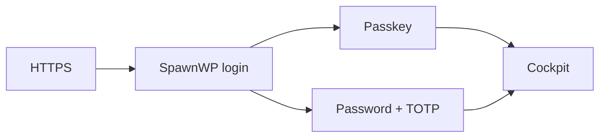

# Accessing the cockpit

The cockpit is served over HTTPS at the `COCKPIT_DOMAIN` chosen during installation.
Every cockpit page, API and attached admin tool requires a valid SpawnWP session.

## First enrollment

Open the cockpit URL and use the one-time activation code from
`/root/spawnwp-credentials.txt`. The code expires after 24 hours and is consumed by a
successful enrollment.

1. Choose the administrator name and a strong password. This password is used only
   when signing in without a passkey and always requires TOTP or a recovery code.
2. Scan the QR code with any TOTP authenticator, such as 2FAS, Aegis (Android),
   Google Authenticator, Microsoft Authenticator, 1Password or Bitwarden, then enter
   its six-digit code. The manual secret is available when scanning is not possible.
3. Let the browser create a passkey using the device PIN or biometrics, a hardware
   security key, or a compatible password manager.
4. Store the ten single-use recovery codes outside the server.

Passkeys are the preferred daily login. Signing in with a password always requires a second factor:
either a current TOTP code or one unused recovery code.

## Protected tools

Adminer and Mailpit are routed through the cockpit hostname. Nginx uses an internal
authentication check against the SpawnWP session before proxying either tool. An
anonymous request is redirected to `/login`; their loopback container ports must never
be exposed publicly.

## Session behavior

- Cookies are `Secure`, `HttpOnly` where applicable and `SameSite=Strict`.
- Sessions have idle and absolute expiration limits.
- State-changing requests require a CSRF token.
- Destructive operations require recent authentication.
- Authentication endpoints have both Nginx and application rate limits.

Signing out revokes the current server-side session. Use `sudo spawnwp auth reset` from
an interactive root shell only for account recovery; it revokes every session and
creates a new one-time activation code.

## Problems signing in

- **Activation code rejected:** check that it was copied completely and has not expired or
  already been consumed. Run `sudo spawnwp auth reset` if recovery is required.
- **Passkey unavailable:** sign in with the password plus TOTP.
- **TOTP rejected:** verify that the phone and server clocks are synchronized
  (`sudo timedatectl set-ntp true`); the timezone does not matter, only the absolute
  time. SpawnWP uses SHA-256 codes, so scan the QR rather than typing the secret by
  hand, and use an app that honours SHA-256 such as Aegis, 2FAS, 1Password or Bitwarden.
- **Recovery code rejected:** recovery codes are single-use. Try an unused code.
- **Too many attempts:** wait for the rate-limit window before retrying.

Next: [Using the cockpit](using-the-cockpit.md).
