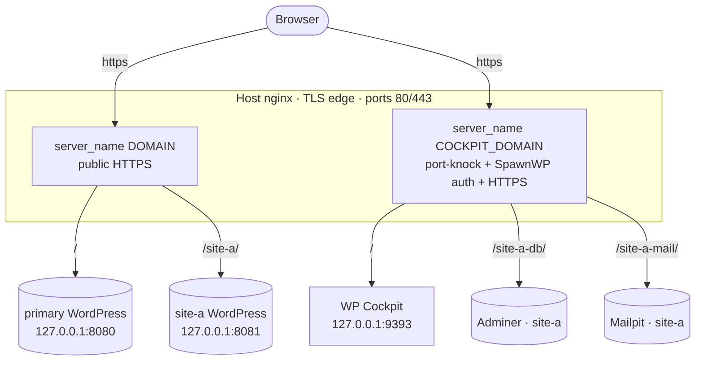
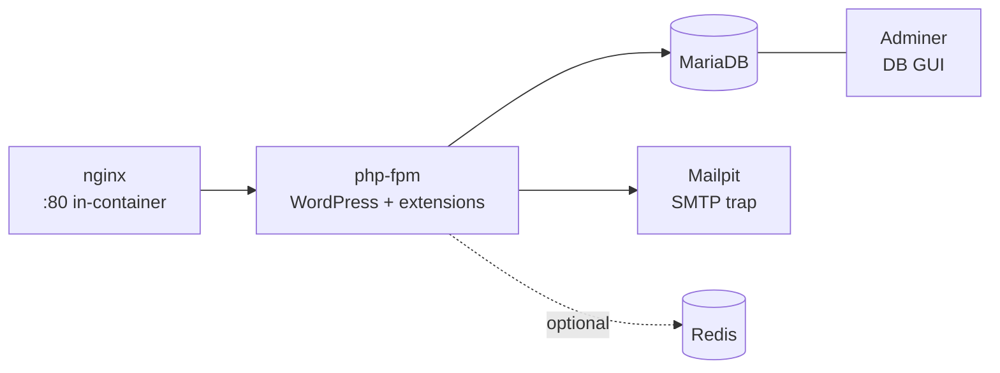

# Architecture

The optional [SpawnWP Deploy plugin](deploying-a-site.md) is separate from the host
control plane. It runs inside WordPress on the source and target and communicates over
the WordPress REST API; SpawnWP itself does not proxy, store or coordinate transfers.

spawnwp is built around two ideas: **one host nginx as the TLS edge**, and **two
hostnames** that cleanly separate WordPress content from admin tooling.

## The two-domain split

- **`DOMAIN`** serves only WordPress: the primary site at `/` and each spawned site
  at `/<site>/`, over public HTTPS.
- **`COCKPIT_DOMAIN`** serves the cockpit at `/` and each site's Adminer (`/<site>-db/`)
  and Mailpit (`/<site>-mail/`). Cockpit sessions protect all admin tooling.

Both hostnames share **one SAN Let's Encrypt certificate**. Putting the admin tools on
their own subdomain removes any conflict between a WordPress page slug and an admin path,
keeps the cockpit's Adminer auto-login same-origin, and serves every web interface over
80/443.

## Per-site container stack

Each site (primary or spawned) is an independent Docker Compose project under `/srv/<name>/`:

- **php** — the WordPress image plus the QA toolchain (WP-CLI, Composer, Node, phpcs +
  WPCS + PHPCompatibilityWP, phpstan + WP stubs, Xdebug).
- **db** — MariaDB, data on a named volume.
- **mailpit** — captures all outgoing mail; persistent, served under `/<site>-mail/`.
- **adminer** — database GUI, served under `/<site>-db/`.
- **redis** — optional object cache (Compose `redis` profile).

Plugin and theme source lives on a **host bind mount** at
`/srv/<name>/projects/primary/wp-content/{plugins,themes}/`, so you edit it from the host.
Every container port binds to **loopback only** — the host nginx is the single public entry.

## The cockpit

A small FastAPI app (`/srv/wp-cockpit`, `127.0.0.1:9393`) that shells out to
`docker compose` and `make` against each site directory. It exposes read-only metrics
and a **whitelisted** set of actions (up/down/restart/snapshot/restore/destroy/php-switch/
new-project). No arbitrary command execution, no Docker socket mounted.

Spawning and destroying a site (`make new-project` / the Destroy button) also writes the
matching nginx blocks: the WordPress block on `DOMAIN`, the Adminer/Mailpit blocks on
`COCKPIT_DOMAIN`.

## Host services

| Service | Role |
|---|---|
| `nginx` | TLS edge + reverse proxy for both hostnames |
| `certbot` | Let's Encrypt issuance + automatic renewal |
| `wp-cockpit` (systemd) | The cockpit app |
| `knockd` + `cockpit-reaper.timer` | Optional source-IP gate with idle expiry |
| `docker-prune.timer` | Weekly Docker build-cache cleanup |

See [Security](security.md) for the full protection model.
