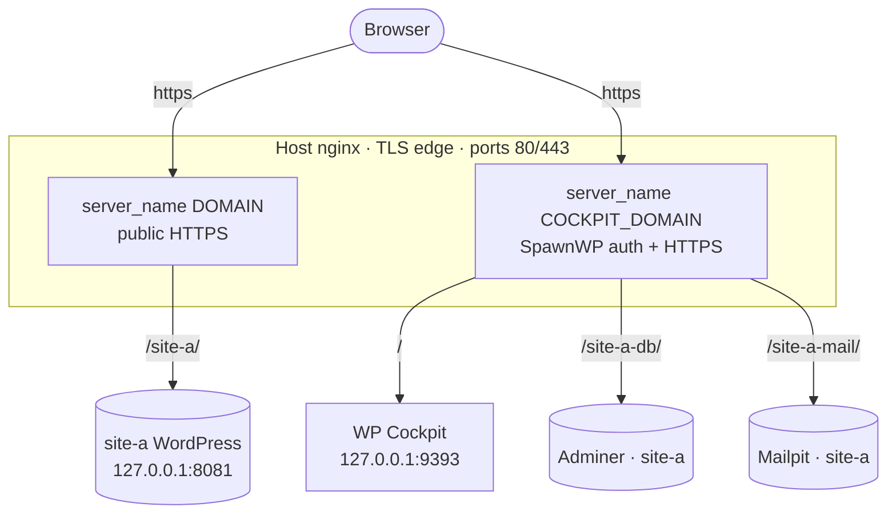
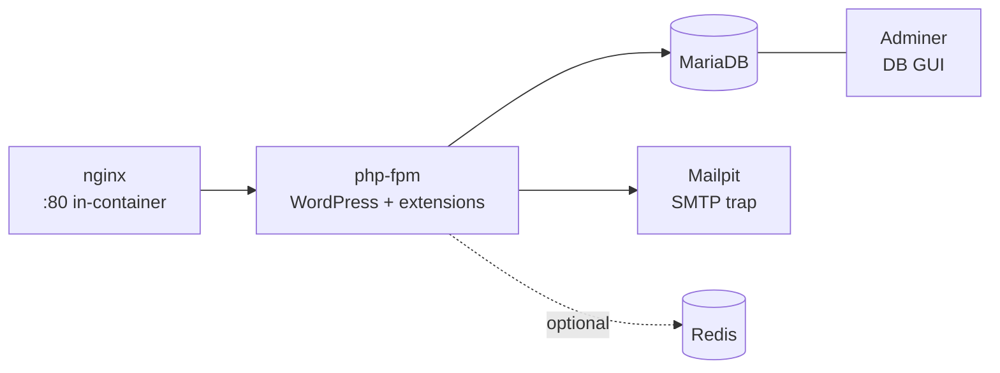

# Architecture

The optional [SpawnWP Deploy WordPress plugin](deploying-a-site.md) is separate from
the installer, cockpit and host control plane. It is never installed automatically. If
chosen by the user, it runs inside a source and target WordPress site and communicates
through the WordPress REST API; the SpawnWP control plane does not proxy, store or
coordinate transfers.

SpawnWP is built around two ideas: **one host nginx as the TLS edge**, and **two
hostnames** that cleanly separate WordPress content from admin tooling.

## The two-domain split

- **`DOMAIN`** serves spawned WordPress environments at `/<site>/`, over public HTTPS.
- **`COCKPIT_DOMAIN`** serves the cockpit at `/` and each site's Adminer (`/<site>-db/`)
  and Mailpit (`/<site>-mail/`). Cockpit sessions protect all admin tooling.

Both hostnames share **one SAN Let's Encrypt certificate**. Putting the admin tools on
their own subdomain removes any conflict between a WordPress page slug and an admin path,
keeps the cockpit's Adminer auto-login same-origin, and serves every web interface over
80/443.

## Per-site container stack

Each spawned site is an independent Docker Compose project under `/srv/<name>/`:

- **php** — the WordPress image plus the QA toolchain (WP-CLI, Composer, Node, phpcs +
  WPCS + PHPCompatibilityWP, phpstan + WP stubs, Xdebug).
- **db** — MariaDB, data on a named volume.
- **mailpit** — captures all outgoing mail; persistent, served under `/<site>-mail/`.
- **adminer** — database GUI, served under `/<site>-db/`.
- **redis** — optional object cache (Compose `redis` profile).

Plugin and theme source lives on a **host bind mount** at
`/srv/<name>/projects/primary/wp-content/{plugins,themes}/`, so you edit it from the host.
Every container port binds to **loopback only** — the host nginx is the single public entry.

## The cockpit

A small FastAPI app (`/srv/wp-cockpit`, `127.0.0.1:9393`) that shells out to
`docker compose` and `make` against each site directory. It exposes read-only metrics
and a **whitelisted** set of actions (up/down/restart/snapshot/restore/destroy/php-switch/
new-project). No arbitrary command execution, no Docker socket mounted.

Spawning and destroying a site (`make new-project` / the Destroy button) also writes the
matching nginx blocks: the WordPress block on `DOMAIN`, the Adminer/Mailpit blocks on
`COCKPIT_DOMAIN`.

The cockpit also hosts the **blueprint ingest API** (`/api/ingest/*`, since 0.4.0):
the only cockpit surface reachable without a session, authenticated instead by
per-connection Ed25519 request signatures (see [Security](security.md)). It accepts
content-blueprint captures pushed from the SpawnWP Deploy plugin, verifies and
hardens them, and installs manifest (in `/etc/spawnwp/blueprints.d/`) and payload
(in `/var/lib/spawnwp/blueprints/<id>/`) atomically. Connection and upload state
lives in a root-only SQLite database (`/var/lib/spawnwp/ingest.db`).

## Host services

| Service | Role |
|---|---|
| `nginx` | TLS edge + reverse proxy for both hostnames |
| `certbot` | Let's Encrypt issuance + automatic renewal |
| `wp-cockpit` (systemd) | The cockpit app |
| `docker-prune.timer` | Weekly Docker build-cache cleanup (layers unused for 72h) |

See [Security](security.md) for the full protection model.
