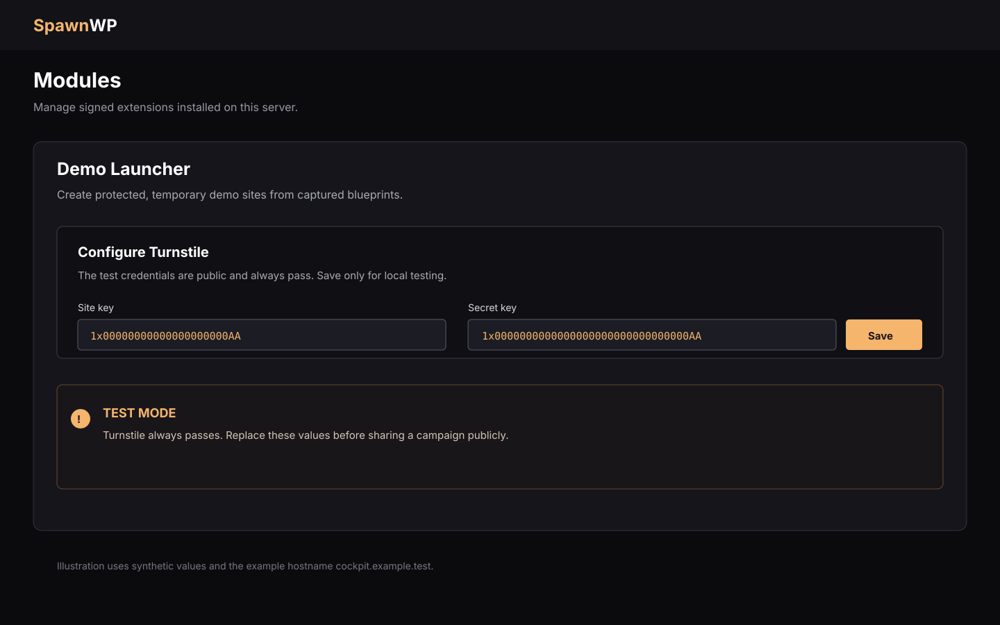
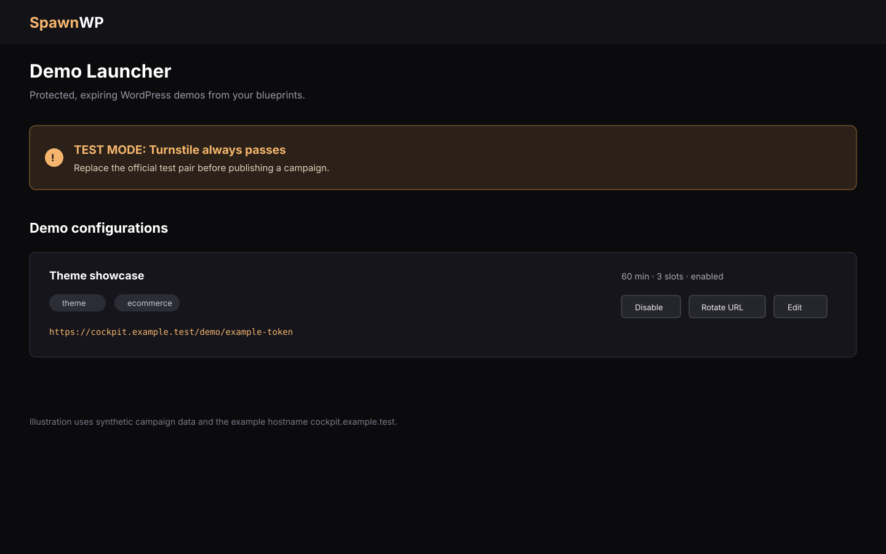
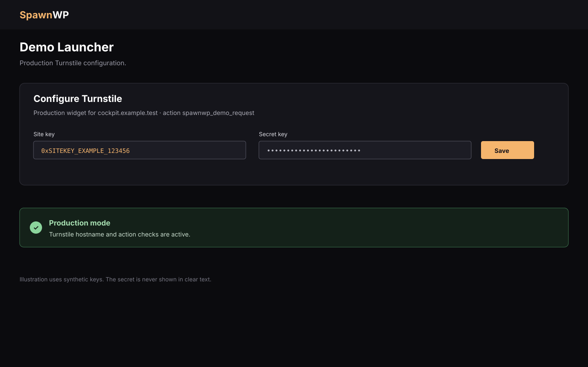
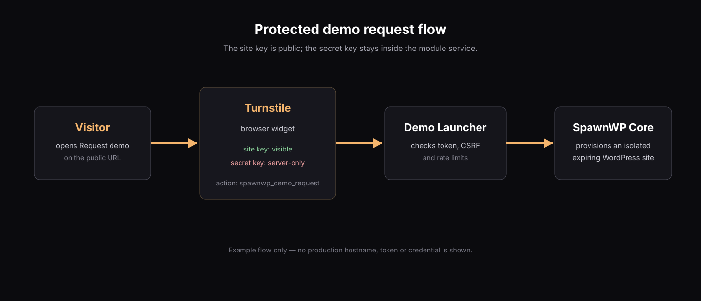

# Configure Cloudflare Turnstile

The optional [Demo Launcher](modules.md) uses Cloudflare Turnstile to prevent
uncontrolled anonymous provisioning. Turnstile protects the public request form;
it is not part of the core SpawnWP installation.



## What a new server does

The main SpawnWP installer does **not** install Demo Launcher and does not create
any Turnstile configuration. Installing the module separately creates its service
and state directory, but leaves the Turnstile settings unconfigured until an
administrator saves them in **Modules → Demo Launcher**.

Until then, a public demo cannot be opened and reports `Demo service is not
configured`. This is intentional: a fresh server never silently starts a public
provisioning endpoint.

## Test the integration

You do not need a Cloudflare account for the first end-to-end test. The module's
setup form is prefilled with Cloudflare's official always-pass pair:

```text
Site key:   1x00000000000000000000AA
Secret key: 1x0000000000000000000000000000000AA
```

1. Install and enable Demo Launcher.
2. Open **Modules → Demo Launcher**.
3. Leave the prefilled values unchanged and select **Save**.
4. Create a campaign from an available blueprint.
5. Open the generated URL and submit a request.

The values are only suggestions until **Save** is selected. When this exact pair
is active, the Cockpit and public page show a **TEST MODE** warning. The test pair
always passes and provides no bot protection, so never publish a campaign with it.



## Configure production keys

For a public campaign, create a Turnstile widget in the Cloudflare dashboard and
use the **Managed** widget mode unless you have a specific reason to choose another
mode.

Authorize the exact hostname used by the Cockpit, for example
`cockpit.example.com`. Demo URLs are served from that hostname, and the module
checks both the returned hostname and the action `spawnwp_demo_request`.

Copy the widget's site key and secret key into **Modules → Demo Launcher**, then
select **Save**. The site key is rendered in the visitor's browser; the secret key
is used only by the module service and must never be placed in JavaScript, commits,
screenshots or support tickets.



After saving, open a campaign URL in a private browser window and submit one test
request. A production configuration no longer shows the TEST MODE warning. If the
request fails, confirm the hostname, widget status, site/secret key pair and the
`spawnwp_demo_request` action before rotating anything else.

## Privacy and operational notes

Turnstile is a third-party anti-abuse service and receives challenge and network
data from visitors. Publish the appropriate privacy disclosure for your site.
SpawnWP does not collect an email address for a demo request. Source addresses are
stored only as keyed hashes for rate limiting and removed after 24 hours.



Keep public demos on a dedicated development host, use short lifetimes and avoid
capturing sensitive data in the blueprint. Replacing keys is safe: save the new
pair, run a private request, and then disable or rotate the old widget in Cloudflare.

## Troubleshooting

| Symptom | Check |
|---|---|
| `Demo service is not configured` | Save a valid site/secret pair in the module setup form. |
| `TEST MODE` warning remains | The official test pair is still saved; replace it with production keys. |
| Hostname mismatch | Add the exact Cockpit hostname to the Cloudflare widget. |
| Anti-abuse verification failed | Check that the site key and secret key belong to the same widget and that the widget is active. |
| Action mismatch | Keep the widget action as `spawnwp_demo_request`; custom actions are rejected. |

For module installation, lifecycle commands and the signed-package boundary, see
[Optional modules](modules.md). For the broader threat model, see [Security](security.md).
